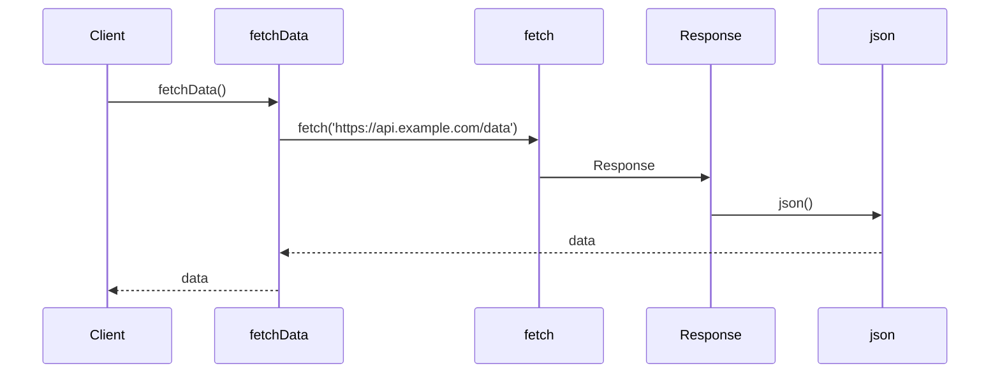

# NOTES

This file contains notes about the project, including setup instructions, running instructions, testing instructions, and other relevant information.

## SETUP

The following commands will setup the project. You can run them one by one. This is what you would do to setup the project from scratch. However, this project is already setup, so you can skip this step. It is here for reference.

### init

npm init -y

### install runtime deps (always latest)

npm i express zod dotenv-cli
npm i -D typescript ts-node-dev @types/node @types/express

### testing

npm i -D jest ts-jest supertest @types/jest supertest @types/supertest

## RUNNING

### run dev server

npm run dev

## TESTING

### run tests

npm test

## NOTES

### What is `Promise<T>`?

A Promise is an object that represents the eventual completion (or failure) of an asynchronous operation and its resulting value. It is a way to handle asynchronous operations in a more structured and predictable way. A Promise can be in one of three states: pending, fulfilled, or rejected. When a Promise is fulfilled, it means that the operation completed successfully and the resulting value is available. When a Promise is rejected, it means that the operation failed and an error is available.

The easiest way to think about a Promise is to think of it as a container that holds a value that may not be available yet, but will be in the future. For example, when you make an HTTP request, the request may not complete immediately, but the response will be available at some point in the future. You can use a Promise to represent this response, and you can use the `then` method to handle the response when it is available.

Here is an example of a function that returns a new Promise:

```typescript
function fetchData() {
  return new Promise((resolve, reject) => {
    // Do some async work
    // When it is done, call resolve or reject
  });
}
```

The `resolve` and `reject` functions are used to signal the completion of the Promise. The `resolve` function is called when the Promise is fulfilled, and the `reject` function is called when the Promise is rejected. Generally, you will not need to create your own Promises, but you will need to use them as a consumer because JavaScript/TypeScript is an asynchronous language and the browser or server APIs are asynchronous and return Promises.

To make it easier to work with Promises, you can use the `async` and `await` keywords. For example:

```typescript
async function fetchData() {
  const response = await fetch("https://api.example.com/data");
  const data = await response.json();
  return data;
}
```

The `async` keyword indicates that the function returns a Promise, and the `await` keyword is used to wait for the Promise to resolve before continuing with the rest of the function. This makes it easier to work with Promises and makes the code more readable and maintainable. The `fetch` function returns a Promise that resolves to a Response object, which represents the response to the HTTP request. The `json` method of the Response object returns a Promise that resolves to the JSON representation of the response body. Both of these functions are asynchronous, so we use `async` and `await` to handle them. Because `await` can only be used inside an `async` function, we use `async` to make the function an `async` function.

Here is how you would define the `fetchData` function without using `async` and `await`:

```typescript
function fetchData() {
  return fetch("https://api.example.com/data").then((response) =>
    response.json(),
  );
}
```

We will prefer the `async` and `await` syntax because it is more readable and easier to understand unless we have a specific reason to use the `Promise` syntax. Here is a sequence diagram of the `fetchData` function:



The solid line represents a synchronous call, and the dashed line represents an asynchronous call. The arrowhead represents the direction of the call, and the participant name represents the entity making the call. The message name represents the action being performed. In this case, the `fetchData` function is making a call to the `fetch` function, which returns a `Promise` that resolves to a `Response` object. The `Response` object has a `json` method that returns a `Promise` that resolves to the JSON representation of the response body.

### What is ISO?

ISO stands for International Organization for Standardization. It is an organization that develops and publishes international standards for a wide range of industries and sectors.

The ISO 8601 standard defines a string representation of a date and time. For example, "2026-01-28T12:34:56Z" is an ISO string. It is a standard format for representing dates and times in a way that is both human-readable and machine-readable. It is the default format for representing dates and times in HTTP responses and is often used in APIs as well as logging and other applications.

The "2026-01-28T12:34:56Z" string is an ISO string. The "Z" at the end of the string indicates that the time is in UTC (Coordinated Universal Time). If the time were in a different time zone, it would be represented as "2026-01-28T12:34:56-05:00", where "-05:00" indicates the offset from UTC.

You can convert a date and time to an ISO string using the `toISOString()` method in JavaScript/TypeScript. For example:

```typescript
const now = new Date();
const isoString = now.toISOString();
console.log(isoString); // e.g. "2026-01-28T12:34:56.789Z"
```

You can convert an ISO string to a date and time using the `Date` constructor in JavaScript/TypeScript. For example:

```typescript
const isoString = "2026-01-28T12:34:56.789Z";
const date = new Date(isoString);
console.log(date); // e.g. "2026-01-28T12:34:56.789Z"
```

## WHAT IS ZOD?

Zod is a TypeScript-first schema validator. It is a library that provides a way to define and validate data structures in TypeScript. It is a type-safe alternative to JSON Schema and provides a more powerful and flexible way to validate data. It is a popular choice for validating data in TypeScript applications. Here is an example:

```typescript
const schema = z.object({
  name: z.string(),
  age: z.number().min(18),
  email: z.email(),
});
```

This defines a schema that has three properties: `name`, `age`, and `email`. The `name` property is a string, the `age` property is a number that must be at least 18, and the `email` property is a string that must be a valid email address.

```typescript
const result = schema.safeParse({
  name: "John Doe",
  age: 25,
  email: "john.doe@example.com",
});

if (result.success) {
  console.log("Valid data:", result.data);
} else {
  console.log("Validation errors:", result.error.format());
}
```

This will validate the data and return a result object that contains the validation result and any error messages if the data is invalid.
