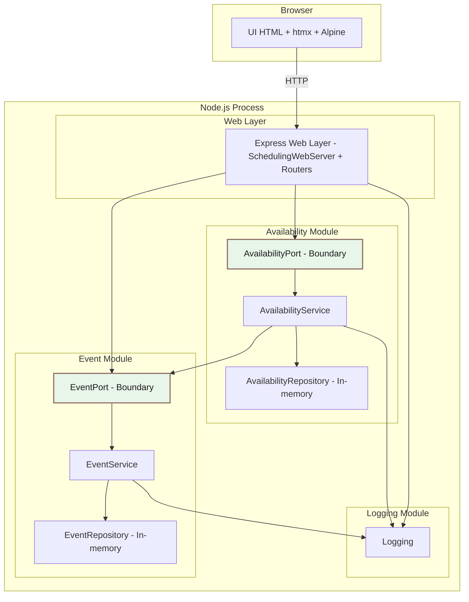
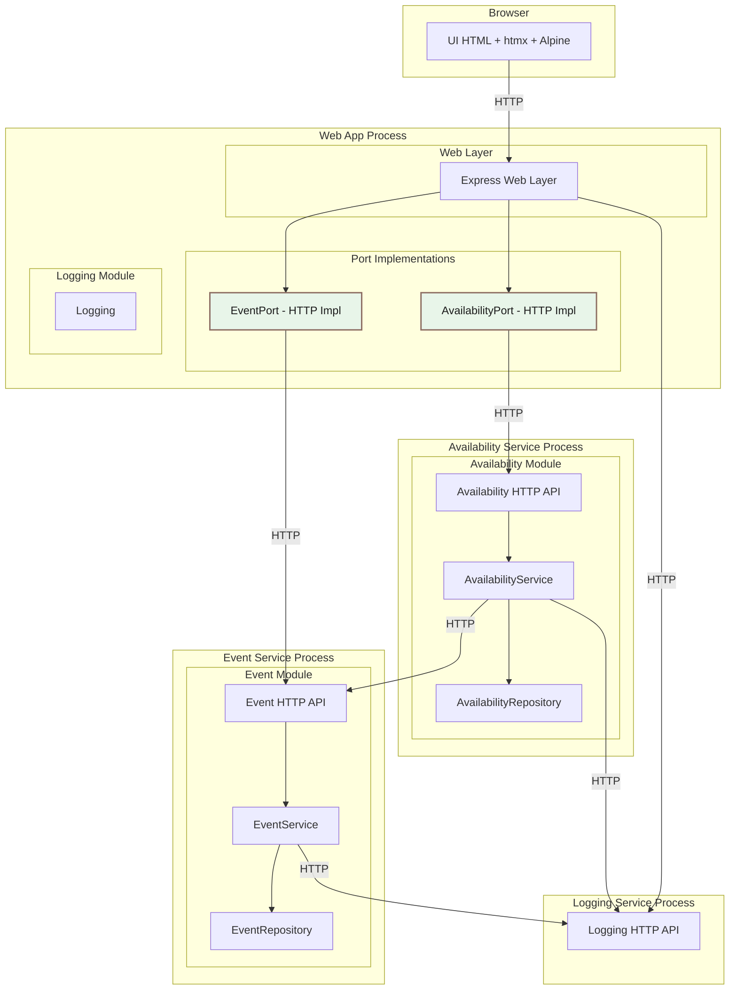

# ARCHITECTURE NOTES

This document explains the architecture and includes two diagrams. The first
shows our **modular monolith** (everything in one process). The second shows the
**same design split into multiple processes**. We use the same module boundaries
in both diagrams to show that the structure does not change — only where the
code runs.

We will introduce microservices later, but this document is here to build
confidence in the current design and to show how it naturally grows.

## Diagram 1: Modular Monolith (Single Process)

This diagram shows the app as one running program. Inside that program, the code
is still divided into clear boxes (modules). That is the key idea of a modular
monolith: one process, many clean boundaries.

### What This Diagram Is Saying (Plain Language)

- The browser talks to the web server (Express) using HTTP.
- Inside the app, each module is in its own box.
- The **ports** (highlighted in an off white color) are the doors between
  modules.
- The Event module and Availability module do not reach into each other
  directly. They talk through ports.
- Logging is shared, but it is still its own module so it stays consistent.

So even though everything runs in one program, the shape is already “service‑
like.” That makes it easier to grow later.

## Diagram 2: Same Architecture, Multiple Processes

This diagram shows the _same_ modules, but now they run as separate programs.
Notice how the boxes and labels are almost the same — the difference is that the
ports now call HTTP APIs instead of local services.

### What This Diagram Is Saying (Plain Language)

- The UI still talks to a web app.
- The web app still calls **ports** (green boxes).
- The big change: those ports now call other programs over HTTP.
- Each module is now its own running process, but the structure inside each
  process is the same as before.

This is the “save” in our design: we do not need to rewrite the whole app to
split it into services. We replace the port implementations, and the rest of the
code stays the same.

## Future: HTTP Ports for Microservices

We plan to add `HttpEventPort` and `HttpAvailabilityPort` later so the
application can swap in network calls when Event and Availability become
separate services.

Goals for those HTTP ports:

- Implement the same interfaces as the in-process ports.
- Serialize input DTOs and parse output DTOs.
- Convert HTTP failures into `PortError` with status/code/message.

This note is here as a reminder for the next phase.
