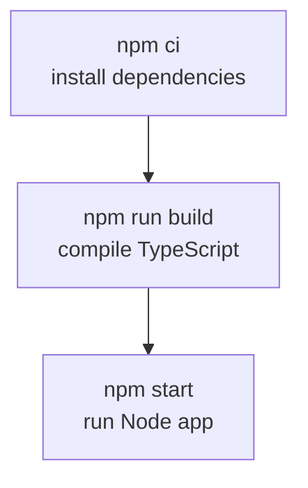

# CONFIGURATION GUIDE

This document explains the configuration files that make this project run. We
keep the tone simple because many of these tools are new when we first learn
TypeScript and Node.js. The big idea is that configuration files describe _how_
the tools should behave, so our code can stay focused on the actual application
logic.

## tsconfig.json (TypeScript Compiler Settings)

`tsconfig.json` tells the TypeScript compiler how to turn our TypeScript code
into JavaScript that Node.js can run. Here is what each setting means and why we
use it:

- `"target": "ES2024"`  
  This tells TypeScript which version of JavaScript to emit. ES2024 is modern
  JavaScript, so we get newer language features and cleaner output. Since this
  is a teaching project, we want code that matches what we read and write.

- `"module": "CommonJS"`  
  This controls the module system used in the output. CommonJS is the default
  module system for Node.js in many setups. It keeps things simple and works
  well with `require`/`module.exports` behind the scenes.

- `"moduleResolution": "node"`  
  This tells TypeScript to find imports the same way Node.js does. That keeps
  TypeScript and Node aligned, so we do not get surprises at runtime.

- `"rootDir": "src"` and `"outDir": "dist"`  
  We keep TypeScript source in `src` and compiled JavaScript in `dist`. This
  makes the project clean and easy to navigate: “source in one place, output in
  another.”

- `"strict": true`  
  This enables strict type checking. It can feel more demanding at first, but it
  catches bugs early and teaches good habits. Strict mode is one of the biggest
  reasons TypeScript is helpful.

- `"esModuleInterop": true`  
  This makes it easier to import CommonJS modules with `import` syntax. It
  smooths out the edges between different module styles.

- `"forceConsistentCasingInFileNames": true`  
  This prevents subtle bugs when file names differ only by case. It helps us
  avoid problems across operating systems.

- `"skipLibCheck": true`  
  This skips type checking for dependencies in `node_modules`. It speeds up
  builds without reducing safety for our own code.

- `"include": ["src"]`  
  This tells TypeScript to compile only the files under `src`.

The overall theme here is **clarity and safety**: we want TypeScript to be
strict and helpful, while keeping the build process simple.

## package.json (Project Manifest)

`package.json` is the central description of a Node.js project. It tells npm the
project name, how to run it, and which dependencies it uses. It is the main
“map” of the project.

### Key Fields

- `"name"` and `"version"`  
  These identify the project. They are especially important if a project is ever
  published. Even in private projects, they help tools understand what they are
  working with.

- `"private": true`  
  This prevents accidental publishing to the public npm registry. It is a safety
  flag that is good to have in teaching projects.

### Scripts

Scripts are the commands we run most often:

- `"dev": "ts-node-dev --respawn --transpile-only src/app.ts"`  
  Runs the app in development mode with auto‑restart on file changes. It is fast
  because it skips type checking and only transpiles.

- `"build": "tsc"`  
  Compiles TypeScript into JavaScript in the `dist` folder.

- `"start": "node dist/app.js"`  
  Runs the compiled JavaScript. This is what we use in production‑style runs.

### Dependencies vs Dev Dependencies

Dependencies are split into two groups:

- `"dependencies"`  
  These are required at runtime. In this project, that includes `express` and
  `ejs`, because the server needs them to run.

- `"devDependencies"`  
  These are tools used only during development, such as TypeScript itself and
  type definitions. They are not required to run the compiled app.

This separation keeps production builds lighter and clarifies which packages are
just for tooling.

## package-lock.json (Exact Dependency Snapshot)

`package-lock.json` is created automatically by npm. It records the exact
versions of every dependency and sub‑dependency that were installed. This is
critical for reproducible builds.

Why it matters:

- It guarantees that everyone installs the same versions, which reduces “it
  works on my machine” problems.
- It protects us from unexpected updates in transitive dependencies.
- It makes builds more reliable across computers and over time.

Even though this file is large and mostly machine‑generated, it is a key part of
real‑world Node.js projects.

## .env Files (Environment Configuration)

We use a `.env` file to store configuration that can change between machines,
such as the port the server listens on. This keeps configuration out of the
code and makes the app easier to run in different environments.

In this project:

- `.env` is ignored by Git, so we do not accidentally commit secrets.
- [`.env.example`](../.env.example) shows the expected variables and format.
- We load the file at startup using `dotenv` in
  [`src/app.ts`](../src/app.ts).

This is a gentle introduction to the idea that code and configuration should
be separate. Later, when we introduce containers and deployment, this habit
will make things much easier.

## How These Files Work Together

Think of it as a small pipeline:

1. `package.json` tells npm what to install and how to run the project.
2. `package-lock.json` locks those installs to exact versions.
3. `tsconfig.json` tells TypeScript how to compile our code.
4. `npm run build` produces JavaScript in `dist`.
5. `npm start` runs that JavaScript with Node.js.

This is the standard workflow in most TypeScript + Node.js projects, and it is
exactly what we want students to learn before moving on to larger systems.

## The Build Process (End to End)

This project builds and runs in a few clear steps. We can think of them as
“compile” and “run,” with a clean install step in front:

1) **Install dependencies**  
   We use `npm ci` to install dependencies exactly as listed in
   `package-lock.json`. The `ci` command is meant for clean, repeatable
   installs. It deletes `node_modules`, uses the lockfile, and avoids surprises.

2) **Compile TypeScript**  
   `npm run build` runs `tsc`, which reads `tsconfig.json` and writes JavaScript
   into the `dist` folder. This is the version of the code that Node runs.

3) **Run the compiled app**  
   `npm start` runs `node dist/app.js`, which starts the server.

In Docker, we follow the same flow:

1) Copy `package.json` and `package-lock.json`.
2) Run `npm ci` for a clean install.
3) Copy the rest of the source code.
4) Run `npm run build` to compile.
5) Start the server with `npm start`.

This keeps the container build predictable and easy to explain.

## Summary

Configuration files can feel intimidating at first, but they exist to make our
work predictable and smooth. Once we understand them, we gain confidence that
our project behaves the same way across machines and over time. That is a big
part of professional software development, and it is one of the reasons
TypeScript and Node.js are such a powerful combination.
