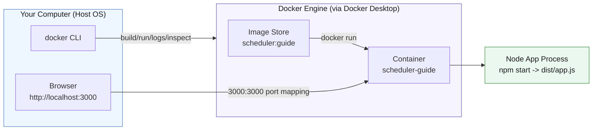
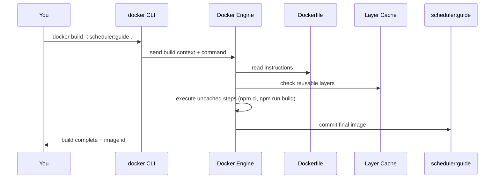
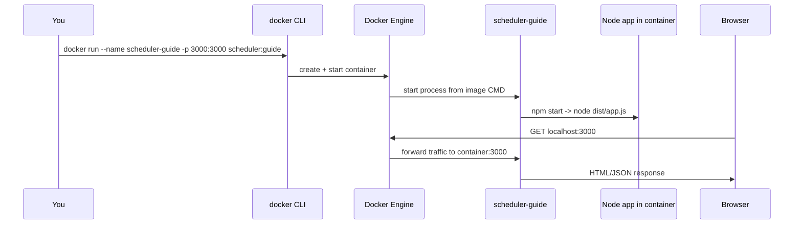

# DOCKER GUIDE

This guide is a practical Docker tutorial built around this repository. The
goal is to move from "I installed Docker" to "I can build, run, inspect, and
debug containers confidently."

If you are new to Docker, follow this guide top to bottom once. After that,
use it as a command reference.

## Learning Goals

By the end, you should be able to:

- Explain the difference between Docker, images, and containers.
- Build this app into an image from `Dockerfile`.
- Run the image as a container with port mapping.
- Inspect container state and logs.
- Enter a running container and verify files/processes.
- Clean up containers/images safely.

## Working Model: What Docker Is Doing

At a high level:

- A `Dockerfile` is a recipe.
- `docker build` executes the recipe and produces an image.
- `docker run` starts a container (running process) from that image.
- We publish a port so browser traffic reaches the process in the container.



## Concept Definitions (Keep These Straight)

- Docker: tooling and runtime for building and running containers.
- Image: immutable packaged blueprint (filesystem + metadata + command).
- Container: running instance of an image.
- Dockerfile: text recipe that defines how to build an image.
- Registry: remote image store (for example Docker Hub).
- Port mapping: host port forwarded to container port (`host:container`).

The most common confusion:

- Image is not running.
- Container is running.

## This Repository's Docker Setup

Key files:

- `Dockerfile`
- `package.json`
- `.env` / `.env.example`

What the `Dockerfile` does in this repo:

1. Uses `node:24.13.0-alpine3.23`.
2. Sets working directory to `/app`.
3. Copies `package*.json` and runs `npm ci`.
4. Copies source and runs `npm run build`.
5. Exposes port `3000`.
6. Starts app with `npm start`.

This directly mirrors the non-Docker flow from `docs/06-CONFIGURATION-GUIDE.md`:
install -> build -> run.

## Part 1 - Verify Docker Is Ready

Run:

```bash
docker --version
docker context ls
docker info
```

Why these three:

- `--version` confirms CLI exists.
- `context ls` shows which engine target is active.
- `info` confirms daemon/engine is reachable.

If `docker info` fails with daemon connection errors, Docker Desktop is not
running yet.

## Part 2 - Build an Image from This Repo

From repo root:

```bash
docker build -t scheduler:guide .
```

What this command does:

- `docker build`: asks Docker to build an image from a Dockerfile.
- `-t scheduler:guide`: assigns a readable name (`scheduler`) and tag
  (`guide`) to the image.
- `.`: uses the current folder as the build context (files Docker can copy).

When to use it:

- Any time you change Dockerfile steps.
- Any time source or dependency changes should be baked into a new image.

Check image exists:

```bash
docker image ls
docker image ls scheduler:guide
```

Build sequence model:



### Why Copy `package*.json` First?

Because dependency installation can be cached as a layer. If app source changes
but dependencies do not, rebuilds are faster.

## Part 3 - Run the App in a Container

Run:

```bash
docker run --name scheduler-guide --env-file .env -p 3000:3000 scheduler:guide
```

What this command does:

- `docker run`: creates and starts a container from an image.
- `--name scheduler-guide`: gives the container a stable name for logs/inspect.
- `--env-file .env`: loads environment variables from `.env`.
- `-p 3000:3000`: maps host port `3000` to container port `3000`.
- `scheduler:guide`: image and tag to run.

When to use it:

- After building an image when you want to test app behavior end-to-end.
- During iterative development when validating runtime behavior in Docker.

Test in browser:

- `http://localhost:3000`
- `http://localhost:3000/health` (should return `{"ok":true}`)

### After It Works: Stop, Remove, and Optional Image Cleanup

If the container is running in your terminal, press `Ctrl+C` first. Then run:

```bash
docker stop scheduler-guide
```

What it does:

- Sends a stop signal to the named container so it shuts down gracefully.

When to use it:

- You are done for now but may want to restart the same container later.

Remove the stopped container:

```bash
docker rm scheduler-guide
```

What it does:

- Deletes the container object (runtime instance and metadata).
- It does not delete the image.

When to use it:

- You want a clean container lifecycle and do not need that instance anymore.

Optional: remove the image too:

```bash
docker image rm scheduler:guide
```

What it does:

- Deletes the local image layers referenced by `scheduler:guide`.

When to use it:

- You want to fully clean up local Docker artifacts for this tutorial.

Important development note:

- During active development, you usually **do not** remove the image every time.
  Keeping it speeds up iteration and rebuild workflows.
- You **should** clean up periodically so old images and containers do not
  accumulate and clutter your system.
- More cleanup patterns (including prune commands) are described later in
  **Part 6 - Cleanup Commands (Use Carefully)**.

Run sequence model:



## Part 4 - Core Commands Every Student Should Know

These are the minimum commands for novice-to-intermediate comfort.

### Inspect Running State

```bash
docker ps
docker ps -a
```

- `docker ps`: lists currently running containers.
  Use when you want to confirm what is live right now.
- `docker ps -a`: lists all containers, including exited ones.
  Use when troubleshooting startup failures or cleanup.

### View Logs

```bash
docker logs scheduler-guide
docker logs -f scheduler-guide
```

- `docker logs scheduler-guide`: prints current stdout/stderr logs.
  Use for first-pass debugging after run/start.
- `docker logs -f scheduler-guide`: follows log stream in real time.
  Use while sending requests to watch app behavior live.

### Inspect Metadata

```bash
docker inspect scheduler-guide
docker inspect scheduler-guide --format '{{.State.Status}}'
docker inspect scheduler-guide --format '{{range .NetworkSettings.Ports}}{{println .}}{{end}}'
```

- `docker inspect scheduler-guide`: full JSON metadata (state, networking,
  mounts, env, image config).
- `--format '{{.State.Status}}'`: quick status only (`running`, `exited`, etc.).
- port format example: quick check of published container ports.

### Enter the Running Container

```bash
docker exec -it scheduler-guide sh
```

- `docker exec`: run a command inside an already-running container.
- `-it`: interactive terminal mode.
- `sh`: open shell in Alpine-based container.

Use this when logs are not enough and you need direct inspection inside the
container filesystem/process environment.

Inside container, useful checks:

```bash
pwd
ls
cat package.json
ls dist
```

Exit shell:

```bash
exit
```

### Process and Resource Visibility

```bash
docker top scheduler-guide
docker stats scheduler-guide
```

- `docker top`: shows processes running in the container.
- `docker stats`: live CPU/memory/network usage.

Use these when diagnosing performance or process-level behavior.

### Stop / Start / Remove

```bash
docker stop scheduler-guide
docker start scheduler-guide
docker rm scheduler-guide
```

- `docker stop`: graceful shutdown of running container.
- `docker start`: restart an existing stopped container.
- `docker rm`: delete a stopped container definition.

If container is running and you want one-step force remove:

```bash
docker rm -f scheduler-guide
```

- `-f` stops and removes in one step.
  Use when you need quick reset and do not care about graceful shutdown.

### Remove Images

```bash
docker image ls
docker image rm scheduler:guide
```

- `docker image ls`: list local images.
- `docker image rm`: remove specific image by name:tag.

If image is in use by a container, remove container(s) first.

## Part 5 - Debugging Workflow (Do This Order)

When "it does not work," use this sequence:

1. Is container running?

```bash
docker ps -a
```

2. If exited, why?

```bash
docker logs <container-name>
```

3. Did port publish correctly?

```bash
docker ps
docker inspect <container-name> --format '{{json .NetworkSettings.Ports}}'
```

4. Is app healthy?

- Visit `http://localhost:3000/health`

5. Need deeper check?

```bash
docker exec -it <container-name> sh
```

This flow solves most beginner issues quickly.

## Part 6 - Cleanup Commands (Use Carefully)

Remove stopped containers:

```bash
docker container prune
```

Remove dangling/unused images:

```bash
docker image prune
```

Remove everything unused (aggressive):

```bash
docker system prune -a
```

Only run prune commands when you understand what will be deleted.

## Part 7 - Mini Lab (Recommended)

Complete this short lab to lock in the workflow:

1. Build image `scheduler:lab`.
2. Run container `scheduler-lab` on `3000:3000`.
3. Verify `/health`.
4. Open a shell with `docker exec -it`.
5. Follow logs with `docker logs -f`.
6. Stop and remove container.
7. Remove image.

If you can complete this from memory, you have novice-plus Docker command fluency.

## Common Mistakes and Fixes

### "Port is already allocated"

- Cause: another process/container already uses host port 3000.
- Fix: stop conflicting process or run with different host port:

```bash
docker run --name scheduler-guide --env-file .env -p 3001:3000 scheduler:guide
```

### "Cannot connect to the Docker daemon"

- Cause: Docker Desktop/daemon is not running.
- Fix: start Docker Desktop, wait for readiness, re-run `docker info`.

### "No such image"

- Cause: tag mismatch.
- Fix: check tags:

```bash
docker image ls
```

Then use the exact repository:tag.

## Summary

Docker gives us a repeatable path from source code to running service:

1. Build image from `Dockerfile`.
2. Run container from image.
3. Observe state/logs.
4. Debug and clean up with predictable commands.

For this repository, the most important commands are:

- `docker build -t scheduler:guide .`
- `docker run --name scheduler-guide --env-file .env -p 3000:3000 scheduler:guide`
- `docker ps`, `docker logs -f`, `docker exec -it`, `docker inspect`
- `docker stop`, `docker rm`, `docker image rm`

Once these become routine, moving to Compose and multi-container systems will
be much easier.
