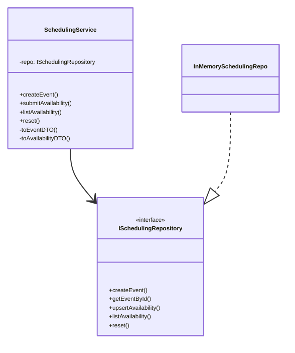
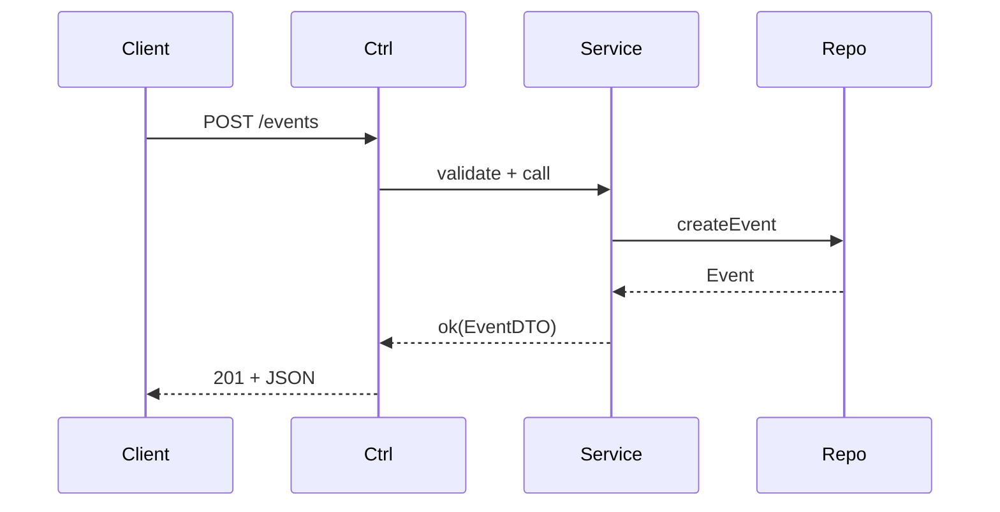
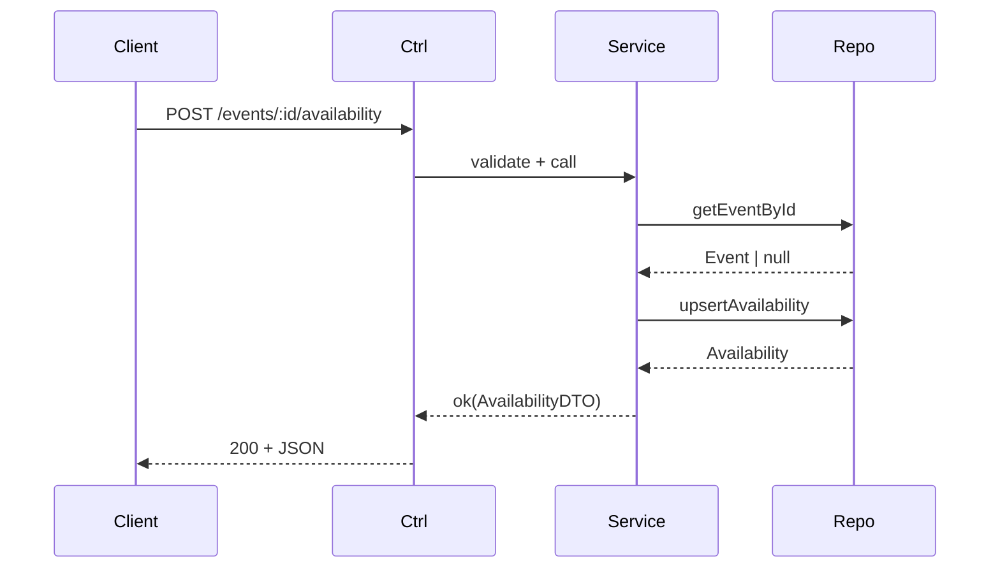

# Scalabe Web Systems
# COMPSCI 426
## Lecture 2.1 The Monolithic System Runs

---
layout: image-right
image: https://schedule.cc/images/blog/calendar-scheduling-tool.png?v=1684144480862882721
---

# Last Time

We started looking at the scheduling monolith:

- **Code Organization**
- **Request/Response Lifecycle**
- **Support Libraries:** `ApiError`, `Result<T, E>`
- **Domain models:** `IEvent`, `IAvailability`
- **Data Transfer Objects (DTOs):** `IEventDTO`, `IAvailabilityDTO`
- **Input Shapes:** `ICreateEventInput`, `ISubmitAvailabilityInput`

---

# Project Structure

This is what we have explored so far:

```plaintext
.
├── lib
│   ├── error.ts
│   ├── http.ts
│   └── result.ts
└── modules
    └── scheduling
        ├── dto
        │   ├── IAvailabilityDTO.ts
        │   └── IEventDTO.ts
        ├── model
        │   ├── IAvailability.ts
        │   └── IEvent.ts
        └── service
            ├── ICreateEventInput.ts
            └── ISubmitAvailabilityInput.ts
```

---

# Project Structure

Today, we are going to look at the rest of the code:

```plaintext
.
├── AppBuilder.ts
├── Server.ts
├── app
│   └── router.ts
├── lib
│   ├── error.ts
│   ├── http.ts
│   └── result.ts
├── modules
│   ├── repository
│   │   └── memory
│   │       └── InMemorySchedulingRepo.ts
│   └── scheduling
│       ├── controller
│       │   ├── SchedulingController.ts
│       │   └── SchedulingControllerValidator.ts
│       ├── dto
│       │   ├── IAvailabilityDTO.ts
│       │   └── IEventDTO.ts
│       ├── model
│       │   ├── IAvailability.ts
│       │   └── IEvent.ts
│       ├── repository
│       │   └── ISchedulingRepository.ts
│       ├── routes
│       │   └── SchedulingRoutesBuilder.ts
│       └── service
│           ├── ICreateEventInput.ts
│           ├── ISubmitAvailabilityInput.ts
│           └── SchedulingService.ts
└── test
    ├── scheduling.int.test.ts
    └── test.http
```

---

# ISchedulingRepository.ts: Repository interface

Path: `src/modules/scheduling/repository/ISchedulingRepository.ts`

The service depends on an interface, not a concrete database. This keeps storage swappable.

```ts
// src/modules/scheduling/repository/ISchedulingRepository.ts (lines 1–30)
import IEvent from "../model/IEvent";
import IAvailability from "../model/IAvailability";

export default interface ISchedulingRepository {
  createEvent(args: {
    title: string;
    timezone: string;
    startsAt: Date;
    endsAt: Date;
  }): Promise<IEvent>;
  getEventById(eventId: string): Promise<IEvent | null>;
  upsertAvailability(args: {
    eventId: string;
    userId: string;
    availableStart: Date;
    availableEnd: Date;
    note?: string;
  }): Promise<IAvailability>;
  listAvailability(eventId: string): Promise<IAvailability[]>;
  reset(): Promise<void>;
}
```

---

# InMemorySchedulingRepo.ts: In‑memory store (1/3)

Path: `src/modules/repository/memory/InMemorySchedulingRepo.ts`

We start with an in‑memory implementation so we can focus on behavior before databases.

```ts
// src/modules/repository/memory/InMemorySchedulingRepo.ts (lines 1–16)
import ISchedulingRepository from "../../scheduling/repository/ISchedulingRepository";
import IEvent from "../../scheduling/model/IEvent";
import IAvailability from "../../scheduling/model/IAvailability";
import crypto from "crypto";

export class InMemorySchedulingRepo implements ISchedulingRepository {
  private events: Map<string, IEvent> = new Map();
  private availabilities: Map<string, IAvailability[]> = new Map();
```

---

# InMemorySchedulingRepo.ts: In‑memory store (2/3)

Path: `src/modules/repository/memory/InMemorySchedulingRepo.ts`

Creating and fetching an event is straightforward: generate IDs, store in a `Map`.

```ts
// src/modules/repository/memory/InMemorySchedulingRepo.ts (lines 17–37)
  async createEvent(args: { title: string; timezone: string; startsAt: Date; endsAt: Date; }): Promise<IEvent> {
    const event: IEvent = {
      id: crypto.randomUUID(),
      title: args.title,
      timezone: args.timezone,
      startsAt: args.startsAt,
      endsAt: args.endsAt,
      createdAt: new Date(),
    };
    this.events.set(event.id, event);
    return event;
  }

  async getEventById(eventId: string): Promise<IEvent | null> {
    return this.events.get(eventId) || null;
  }
```

---

# InMemorySchedulingRepo.ts: In‑memory store (3/3)

Path: `src/modules/repository/memory/InMemorySchedulingRepo.ts`

Availability is **upserted** so each user has a single availability per event.

```ts
// src/modules/repository/memory/InMemorySchedulingRepo.ts (lines 39–79)
  async upsertAvailability(args: { eventId: string; userId: string; availableStart: Date; availableEnd: Date; note?: string; }): Promise<IAvailability> {
    const availabilitiesForEvent = this.availabilities.get(args.eventId) || [];
    let availability = availabilitiesForEvent.find((a) => a.userId === args.userId);

    if (availability) {
      availability.availableStart = args.availableStart;
      availability.availableEnd = args.availableEnd;
      availability.note = args.note;
    } else {
      availability = {
        id: crypto.randomUUID(),
        eventId: args.eventId,
        userId: args.userId,
        availableStart: args.availableStart,
        availableEnd: args.availableEnd,
        note: args.note,
        createdAt: new Date(),
      };
      availabilitiesForEvent.push(availability);
      this.availabilities.set(args.eventId, availabilitiesForEvent);
    }

    return availability;
  }

  async listAvailability(eventId: string): Promise<IAvailability[]> {
    return this.availabilities.get(eventId) || [];
  }

  async reset(): Promise<void> {
    this.events.clear();
    this.availabilities.clear();
  }
}
```

---

# SchedulingService.ts: Service overview

Path: `src/modules/scheduling/service/SchedulingService.ts`

The service layer is where **business rules** live. It validates time boundaries and converts domain models into DTOs for HTTP responses.



---

# SchedulingService.ts: Imports & ctor

Path: `src/modules/scheduling/service/SchedulingService.ts`

```ts
// src/modules/scheduling/service/SchedulingService.ts (lines 1–14)
import type ISchedulingRepository from "../repository/ISchedulingRepository";
import { ApiError } from "../../../lib/error";
import { Result, err, ok } from "../../../lib/result";
import ICreateEventInput from "./ICreateEventInput";
import ISubmitAvailabilityInput from "./ISubmitAvailabilityInput";
import IEventDTO from "../dto/IEventDTO";
import IAvailabilityDTO from "../dto/IAvailabilityDTO";

export default class SchedulingService {
    private readonly repo: ISchedulingRepository;

    constructor(repo: ISchedulingRepository) {
        this.repo = repo;
    }
```

---

# SchedulingService.ts: Create event validation

Path: `src/modules/scheduling/service/SchedulingService.ts`

We parse ISO strings into `Date` and enforce a basic ordering rule.

```ts
// src/modules/scheduling/service/SchedulingService.ts (lines 16–26)
    async createEvent(input: ICreateEventInput): Promise<Result<IEventDTO, ApiError>> {
        const startsAt = new Date(input.startsAt);
        const endsAt = new Date(input.endsAt);

        if (Number.isNaN(startsAt.getTime()) || Number.isNaN(endsAt.getTime())) {
            return err(ApiError.validation("startsAt and endsAt must be valid ISO datetimes"));
        }
        if (endsAt <= startsAt) {
            return err(ApiError.validation("endsAt must be after startsAt"));
        }
```

---

# SchedulingService.ts: Create event persistence

Path: `src/modules/scheduling/service/SchedulingService.ts`

Now we call the repository and map the response to a DTO.

```ts
// src/modules/scheduling/service/SchedulingService.ts (lines 28–35)
        const event = await this.repo.createEvent({
            title: input.title,
            timezone: input.timezone,
            startsAt,
            endsAt
        });

        return ok(this.toEventDTO(event));
    }
```

---

# SchedulingService.ts: Submit availability validation

Path: `src/modules/scheduling/service/SchedulingService.ts`

We check that the event exists and ensure the time interval makes sense.

```ts
// src/modules/scheduling/service/SchedulingService.ts (lines 38–53)
    async submitAvailability(eventId: string, input: ISubmitAvailabilityInput): Promise<Result<IAvailabilityDTO, ApiError>> {
        const event = await this.repo.getEventById(eventId);
        if (!event) return err(ApiError.notFound(`No event exists with id ${eventId}`));

        const start = new Date(input.availableStart);
        const end = new Date(input.availableEnd);

        if (Number.isNaN(start.getTime()) || Number.isNaN(end.getTime())) {
            return err(ApiError.validation("availableStart and availableEnd must be valid ISO datetimes"));
        }
        if (end <= start) {
            return err(ApiError.validation("availableEnd must be after availableStart"));
        }
```

---

# SchedulingService.ts: Submit availability save

Path: `src/modules/scheduling/service/SchedulingService.ts`

The **upsert** ensures each user has one availability per event.

```ts
// src/modules/scheduling/service/SchedulingService.ts (lines 55–67)
        const saved = await this.repo.upsertAvailability({
            eventId,
            userId: input.userId,
            availableStart: start,
            availableEnd: end,
            note: input.note,
        });

        return ok(this.toAvailabilityDTO(saved));
    }
```

---

# SchedulingService.ts: List availability & reset

Path: `src/modules/scheduling/service/SchedulingService.ts`

Listing joins event info with availability records. Reset clears data for tests.

```ts
// src/modules/scheduling/service/SchedulingService.ts (lines 69–83)
    async listAvailability(eventId: string): Promise<Result<{ event: IEventDTO; availability: IAvailabilityDTO[] }, ApiError>> {
        const event = await this.repo.getEventById(eventId);
        if (!event) return err(ApiError.notFound(`No event exists with id ${eventId}`));

        const rows = await this.repo.listAvailability(eventId);

        return ok({ event: this.toEventDTO(event), availability: rows.map((r) => this.toAvailabilityDTO(r)) });
    }

    async reset(): Promise<Result<void, ApiError>> {
        await this.repo.reset();
        return ok(void 0);
    }
```

---

# SchedulingService.ts: DTO mapping

Path: `src/modules/scheduling/service/SchedulingService.ts`

Mapping keeps the HTTP layer free from `Date` objects.

```ts
// src/modules/scheduling/service/SchedulingService.ts (lines 86–115 excerpt)
    private toEventDTO(event: { id: string; title: string; timezone: string; startsAt: Date; endsAt: Date; createdAt: Date }): IEventDTO {
        return {
            id: event.id,
            title: event.title,
            timezone: event.timezone,
            startsAt: event.startsAt.toISOString(),
            endsAt: event.endsAt.toISOString(),
            createdAt: event.createdAt.toISOString()
        };
    }

    private toAvailabilityDTO(row: { id: string; eventId: string; userId: string; availableStart: Date; availableEnd: Date; note?: string | null; createdAt: Date; }): IAvailabilityDTO {
        return {
            id: row.id,
            eventId: row.eventId,
            userId: row.userId,
            availableStart: row.availableStart.toISOString(),
            availableEnd: row.availableEnd.toISOString(),
            note: row.note ?? null,
            createdAt: row.createdAt.toISOString()
        };
    }
```

---

# SchedulingService.ts: Sequence — Create Event

Path: `src/modules/scheduling/service/SchedulingService.ts`



---

# SchedulingService.ts: Sequence — Submit Availability

Path: `src/modules/scheduling/service/SchedulingService.ts`



---

# SchedulingControllerValidator.ts: Zod validation

Path: `src/modules/scheduling/controller/SchedulingControllerValidator.ts`

Zod validates request shapes at the boundary. It doesn’t enforce all business rules; it ensures types and basic constraints before the service runs.

```ts
// src/modules/scheduling/controller/SchedulingControllerValidator.ts (lines 1–21)
import { z } from "zod";

export default class SchedulingControllerValidator {
  static createEventSchema = z.object({
    title: z.string().min(1).max(200),
    timezone: z.string().min(1).max(100),
    startsAt: z.iso.datetime(),
    endsAt: z.iso.datetime(),
  });

  static submitAvailabilitySchema = z.object({
    userId: z.string().min(1).max(200),
    availableStart: z.iso.datetime(),
    availableEnd: z.iso.datetime(),
    note: z.string().max(500).optional(),
  });

  static eventIdSchema = z.string().min(1).max(200);
}
```

---

# SchedulingController.ts: Controller role

Path: `src/modules/scheduling/controller/SchedulingController.ts`

Controllers connect HTTP to services. They validate inputs, call the service, and translate the Result into an HTTP response.

```ts
// src/modules/scheduling/controller/SchedulingController.ts (lines 1–13)
import type { Request, Response } from "express";
import SchedulingService from "../service/SchedulingService";
import { ApiError } from "../../../lib/error";
import { sendResult } from "../../../lib/http";
import { err, ok } from "../../../lib/result";
import V from "./SchedulingControllerValidator";

export default class SchedulingController {
    private readonly service: SchedulingService;

    constructor(service: SchedulingService) {
        this.service = service;
    }
```

---

# SchedulingController.ts: Create event handler

Path: `src/modules/scheduling/controller/SchedulingController.ts`

Notice how little business logic lives here; it’s just validation plus wiring.

```ts
// src/modules/scheduling/controller/SchedulingController.ts (lines 15–26)
    async createEvent(req: Request, res: Response): Promise<void> {
        const parsed = V.createEventSchema.safeParse(req.body);
        if (!parsed.success) {
            sendResult(res, err(ApiError.validation("Invalid request body", parsed.error.flatten())), 400);
            return;
        }

        const result = await this.service.createEvent(parsed.data);
        sendResult(res, result, 201);
    }
```

---

# SchedulingController.ts: Submit availability (1/2)

Path: `src/modules/scheduling/controller/SchedulingController.ts`

Validate the route parameter before using it.

```ts
// src/modules/scheduling/controller/SchedulingController.ts (lines 28–37)
    async submitAvailability(req: Request, res: Response): Promise<void> {
        if (!V.eventIdSchema.safeParse(req.params.eventId).success) {
            sendResult(res, err(ApiError.validation("Missing eventId")), 400);
            return;
        }

        const eventId = req.params.eventId as string;
```

---

# SchedulingController.ts: Submit availability (2/2)

Path: `src/modules/scheduling/controller/SchedulingController.ts`

Validate the body and call the service.

```ts
// src/modules/scheduling/controller/SchedulingController.ts (lines 38–46)
        const parsed = V.submitAvailabilitySchema.safeParse(req.body);
        if (!parsed.success) {
            sendResult(res, err(ApiError.validation("Invalid request body", parsed.error.flatten())), 400);
            return;
        }

        const result = await this.service.submitAvailability(eventId, parsed.data);
        sendResult(res, result, 200);
    }
```

---

# SchedulingController.ts: List availability

Path: `src/modules/scheduling/controller/SchedulingController.ts`

A standard read path: validate, call service, return result.

```ts
// src/modules/scheduling/controller/SchedulingController.ts (lines 48–59)
    async listAvailability(req: Request, res: Response): Promise<void> {
        if (!V.eventIdSchema.safeParse(req.params.eventId).success) {
            sendResult(res, err(ApiError.validation("Missing eventId")), 400);
            return;
        }

        const eventId = req.params.eventId as string;

        const result = await this.service.listAvailability(eventId);
        sendResult(res, result, 200);
    }
```

---

# SchedulingController.ts: Reset endpoint

Path: `src/modules/scheduling/controller/SchedulingController.ts`

This endpoint exists for tests only. It clears state between test cases.

```ts
// src/modules/scheduling/controller/SchedulingController.ts (lines 61–64)
    async reset(req: Request, res: Response): Promise<void> {
        await this.service.reset();
        sendResult(res, ok({ message: "Reset successful" }), 200);
    }
}
```

---

# SchedulingRoutesBuilder.ts: Bind handlers

Path: `src/modules/scheduling/routes/SchedulingRoutesBuilder.ts`

Binding ensures the controller instance remains `this` inside each method.

```ts
// src/modules/scheduling/routes/SchedulingRoutesBuilder.ts (lines 1–15)
import { Router } from "express";
import SchedulingController from "../controller/SchedulingController";
import { asyncHandler } from "../../../lib/http";

export default class SchedulingRoutesBuilder {
    static build(controller: SchedulingController): Router {
        const router = Router();

        const createEventHandler = controller.createEvent.bind(controller);
        const submitAvailabilityHandler = controller.submitAvailability.bind(controller);
        const listAvailabilityHandler = controller.listAvailability.bind(controller);
        const resetHandler = controller.reset.bind(controller);
```

---

# SchedulingRoutesBuilder.ts: Register routes

Path: `src/modules/scheduling/routes/SchedulingRoutesBuilder.ts`

All routes are mounted under `/api` by the app router.

```ts
// src/modules/scheduling/routes/SchedulingRoutesBuilder.ts (lines 17–23)
        router.post("/events", asyncHandler(createEventHandler));
        router.post("/events/:eventId/availability", asyncHandler(submitAvailabilityHandler));
        router.get("/events/:eventId/availability", asyncHandler(listAvailabilityHandler));
        router.post("/reset", asyncHandler(resetHandler));

        return router;
    }
}
```

---

# src/app/router.ts: Imports

The router is the **application boundary**: it combines middleware and routes.

```ts
// src/app/router.ts (lines 1–4)
import express, {
  type Express,
  type NextFunction,
  type Request,
  type Response,
} from "express";
import { ApiError } from "../lib/error";
import SchedulingRoutesBuilder from "../modules/scheduling/routes/SchedulingRoutesBuilder";
import SchedulingController from "../modules/scheduling/controller/SchedulingController";
```

---

# src/app/router.ts: Initialize Express

The constructor builds the Express app and installs middleware.

```ts
// src/app/router.ts (lines 24–30)
constructor(args: { schedulingController: SchedulingController }) {
    // 1. Initialize the Express app
    this.expressApp = express();

    // 2. Common middleware
    this.expressApp.use(express.json());
```

---

# src/app/router.ts: Health & route mount

A health check is simple, but useful in production too.

```ts
// src/app/router.ts (lines 31–41)
// Health check
this.expressApp.get("/health", (_req, res) => res.json({ ok: true }));

// Scheduling API routes
this.expressApp.use(
  "/api",
  SchedulingRoutesBuilder.build(args.schedulingController),
);
```

---

# src/app/router.ts: 404 handler

A consistent 404 response keeps client behavior predictable.

```ts
// src/app/router.ts (lines 44–48)
// Not found handler
this.expressApp.use((_req, res) => {
  res
    .status(404)
    .json({ error: { code: "NOT_FOUND", message: "Route not found" } });
});
```

---

# src/app/router.ts: Error handler

Express error middleware has four parameters. We use it to shape all server errors.

```ts
// src/app/router.ts (lines 50–73)
    this.expressApp.use((error: unknown, _req: Request, res: Response, _next: NextFunction) => {
        if (error instanceof ApiError) {
            res.status(error.status).json({
                error: {
                    code: error.code,
                    message: error.message,
                    details: error.details ?? null
                }
            });
            return;
        }

        res.status(500).json({
            error: {
                code: "INTERNAL_ERROR",
                message: "Unexpected error",
                details: String(error)
            }
        });
    });
}
```

---

# src/app/router.ts: Expose Express

This method lets the server and tests use the configured app instance.

```ts
// src/app/router.ts (lines 77–80)
getExpress(): Express {
    return this.expressApp;
}
```

---

# src/AppBuilder.ts: Wiring the app

AppBuilder is the _composition root_ of the monolith. It makes the object graph explicit.

```ts
// src/AppBuilder.ts (lines 1–4)
import { AppRouter } from "./app/router";
import { InMemorySchedulingRepo } from "./modules/repository/memory/InMemorySchedulingRepo";
import SchedulingService from "./modules/scheduling/service/SchedulingService";
import SchedulingController from "./modules/scheduling/controller/SchedulingController";
```

---

# src/AppBuilder.ts: Constructing the graph

Here is the single place we can swap storage or service implementations.

```ts
// src/AppBuilder.ts (lines 14–21)
export default class AppBuilder {
  static build(): AppRouter {
    const repo = new InMemorySchedulingRepo();
    const service = new SchedulingService(repo);
    const controller = new SchedulingController(service);

    return new AppRouter({ schedulingController: controller });
  }
}
```

---

# src/Server.ts: Bootstrapping the monolith

The server file is intentionally tiny: its entire job is to start listening.

```ts
// src/Server.ts (lines 1–15)
import AppBuilder from "./AppBuilder";

class Server {
  static start() {
    const port = Number(process.env.PORT ?? 3000);

    const app = AppBuilder.build().getExpress();

    console.log(`Database URL: ${process.env.DATABASE_URL}`);

    app.listen(port, () => {
      console.log(`Listening on http://localhost:${port}`);
    });
  }
}
```

---

# src/Server.ts: Main entry point

```ts
// src/Server.ts (lines 18–19)
Server.start();
```

---

# scheduling.int.test.ts: Test setup

Path: `src/test/scheduling.int.test.ts`

Integration tests run the real Express app in memory with Supertest.

```ts
// src/test/scheduling.int.test.ts (lines 1–13)
import request from "supertest";
import AppBuilder from "../AppBuilder";

describe("Scheduling API (integration)", () => {
    const app = AppBuilder.build().getExpress();

    beforeEach(async () => {
        await request(app).post("/api/reset").expect(200);
    });
```

---

# scheduling.int.test.ts: Happy path

Path: `src/test/scheduling.int.test.ts`

The test shows the complete workflow: create → submit availability → list.

```ts
// src/test/scheduling.int.test.ts (lines 14–52 excerpt)
test("create event, submit availability, list availability, data survives across requests", async () => {
  const createRes = await request(app)
    .post("/api/events")
    .send({
      title: "Office Hours Planning",
      timezone: "America/New_York",
      startsAt: "2026-02-01T14:00:00.000Z",
      endsAt: "2026-02-01T16:00:00.000Z",
    })
    .expect(201);

  const eventId = createRes.body.id as string;

  const availRes = await request(app)
    .post(`/api/events/${eventId}/availability`)
    .send({
      userId: "alice",
      availableStart: "2026-02-01T14:30:00.000Z",
      availableEnd: "2026-02-01T15:15:00.000Z",
      note: "Prefer earlier",
    })
    .expect(200);

  const listRes = await request(app)
    .get(`/api/events/${eventId}/availability`)
    .expect(200);
  expect(listRes.body.availability[0].userId).toBe("alice");
});
```

---

# scheduling.int.test.ts: Error cases

Path: `src/test/scheduling.int.test.ts`

Validation and not‑found behavior are part of the contract.

```ts
// src/test/scheduling.int.test.ts (lines 54–71)
    test("unknown event returns 404", async () => {
        const res = await request(AppBuilder.build().getExpress()).get("/api/events/does-not-exist/availability").expect(404);
        expect(res.body.error.code).toBe("NOT_FOUND");
    });

    test("validation rejects bad time interval", async () => {
        const createRes = await request(AppBuilder.build().getExpress())
            .post("/api/events")
            .send({
                title: "Bad Event",
                timezone: "America/New_York",
                startsAt: "2026-02-01T16:00:00.000Z",
                endsAt: "2026-02-01T14:00:00.000Z"
            })
            .expect(400);

        expect(createRes.body.error.code).toBe("VALIDATION_ERROR");
    });
});
```

---

# test.http: Manual HTTP checks

Path: `src/test/test.http`

This file is a friendly way to experiment without a full client app.

```http
// src/test/test.http (lines 1–15)
## Create Event
POST http://localhost:3000/api/events
Content-Type: application/json

{
    "title": "Test Event",
    "timezone": "America/New_York",
    "startsAt": "2026-01-29T00:00:00Z",
    "endsAt": "2026-01-29T01:00:00Z"
}
```

---

# package.json: Scripts

These scripts are the control panel for development, testing, and production builds.

```json
// package.json (scripts excerpt)
"scripts": {
  "dev1": "dotenv -- ts-node-dev --respawn --transpile-only src/Server.ts",
  "dev": "dotenv -- node --watch -r ts-node/register src/server.ts",
  "build": "tsc -p tsconfig.json",
  "start": "node --env-file=.env dist/Server.js",
  "test": "dotenv -- jest --runInBand"
}
```

---

# package.json: Dependencies

These are the building blocks: Express for HTTP, Zod for validation, Jest/Supertest for tests.

```json
// package.json (deps excerpt)
"dependencies": {
  "dotenv-cli": "^11.0.0",
  "express": "^5.2.1",
  "zod": "^4.3.6"
},
"devDependencies": {
  "@types/express": "^5.0.6",
  "@types/jest": "^30.0.0",
  "@types/node": "^25.1.0",
  "@types/supertest": "^6.0.3",
  "jest": "^30.2.0",
  "supertest": "^7.2.2",
  "ts-jest": "^29.4.6",
  "ts-node-dev": "^2.0.0",
  "typescript": "^5.9.3"
}
```

---

# tsconfig.json: TypeScript compiler

`tsconfig.json` defines how TypeScript compiles to JavaScript and how strict type‑checking is.

```json
// tsconfig.json
{
  "compilerOptions": {
    "target": "ES2022",
    "lib": ["ES2022"],
    "module": "commonjs",
    "moduleResolution": "node",
    "rootDir": "src",
    "outDir": "dist",
    "strict": true,
    "esModuleInterop": true,
    "forceConsistentCasingInFileNames": true,
    "skipLibCheck": true
  }
}
```

---

# jest.config.ts: Test runner configuration

Jest uses `ts-jest` to execute TypeScript test files directly.

```ts
// jest.config.ts
import type { Config } from "jest";

const config: Config = {
  preset: "ts-jest",
  testEnvironment: "node",
  testMatch: ["**/*.test.ts"],
  clearMocks: true,
  verbose: true,
};

export default config;
```

---

# README.md: References — Languages & Runtime

- [TypeScript Handbook](https://www.typescriptlang.org/docs/)
- [JavaScript on MDN](https://developer.mozilla.org/en-US/docs/Web/JavaScript)
- [Node.js Documentation](https://nodejs.org/en/docs)
- [npm Documentation](https://docs.npmjs.com/)

---

# README.md: References — TypeScript concepts

- [Interfaces](https://www.typescriptlang.org/docs/handbook/2/everyday-types.html#interfaces)
- [Union Types](https://www.typescriptlang.org/docs/handbook/2/everyday-types.html#union-types)
- [Generics](https://www.typescriptlang.org/docs/handbook/2/generics.html)
- [Modules](https://www.typescriptlang.org/docs/handbook/modules.html)

---

# README.md: References — JavaScript concepts

- [Promises](https://developer.mozilla.org/en-US/docs/Web/JavaScript/Reference/Global_Objects/Promise)
- [async/await](https://developer.mozilla.org/en-US/docs/Web/JavaScript/Reference/Statements/async_function)
- [Date](https://developer.mozilla.org/en-US/docs/Web/JavaScript/Reference/Global_Objects/Date)
- [Map](https://developer.mozilla.org/en-US/docs/Web/JavaScript/Reference/Global_Objects/Map)
- [Classes](https://developer.mozilla.org/en-US/docs/Web/JavaScript/Reference/Classes)

---

# README.md: References — HTTP & APIs

- [HTTP overview (MDN)](https://developer.mozilla.org/en-US/docs/Web/HTTP/Overview)
- [HTTP methods (MDN)](https://developer.mozilla.org/en-US/docs/Web/HTTP/Methods)
- [JSON (MDN)](https://developer.mozilla.org/en-US/docs/Web/JavaScript/Reference/Global_Objects/JSON)
- [ISO 8601 date format](https://en.wikipedia.org/wiki/ISO_8601)

---

# README.md: References — Express

- [Express Documentation](https://expressjs.com/)
- [Express Routing](https://expressjs.com/en/guide/routing.html)
- [Express Error Handling](https://expressjs.com/en/guide/error-handling.html)
- [Express Middleware](https://expressjs.com/en/guide/using-middleware.html)

---

# README.md: References — Validation & Testing

- [Zod Documentation](https://zod.dev/)
- [Zod `safeParse`](https://zod.dev/?id=safeparse)
- [Jest Documentation](https://jestjs.io/docs/getting-started)
- [Supertest GitHub](https://github.com/ladjs/supertest)

---

# README.md: References — Tooling

- [dotenv-cli GitHub](https://github.com/entropitor/dotenv-cli)
- [ts-jest Documentation](https://kulshekhar.github.io/ts-jest/)
- [ts-node-dev GitHub](https://github.com/wclr/ts-node-dev)
- [Slidev Documentation](https://sli.dev/)

---

# README.md: Closing note

This monolith is intentionally small, but it is **structurally complete**: a clean boundary between HTTP, validation, business rules, and storage. The next step is not to abandon the monolith—it is to **evolve** it, one well‑designed boundary at a time.

<style>
.mermaid-fit .mermaid {
  transform: scale(0.75);
  transform-origin: top left;
}

.mermaid-fit .mermaid svg {
  width: 100% !important;
  height: auto !important;
}

/* Global base size */
.slidev-layout {
  font-size: 1.6rem; /* try 1.2–1.4 */
}

/* Optional: keep body text consistent */
.slidev-layout p,
.slidev-layout li {
  font-size: 20px;
}
</style>
